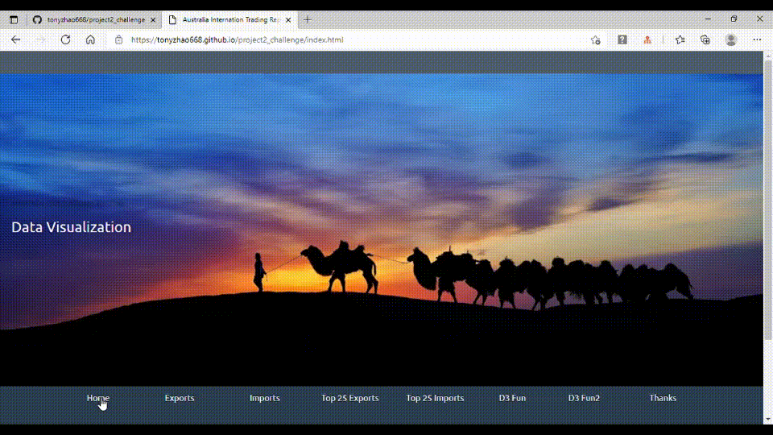
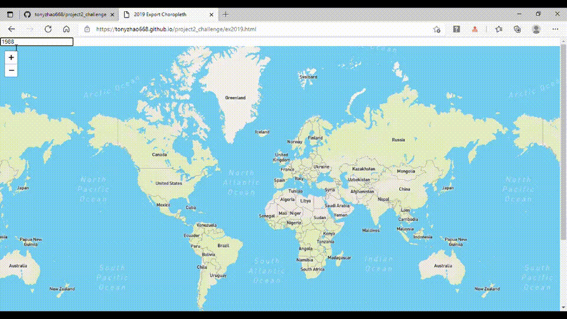
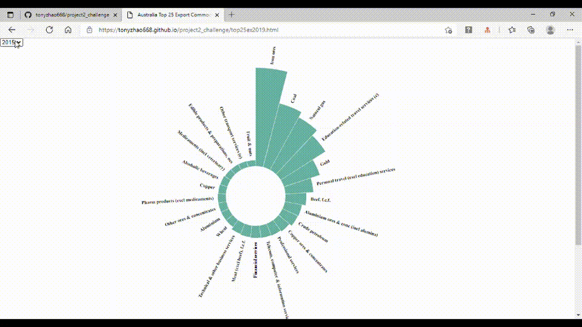
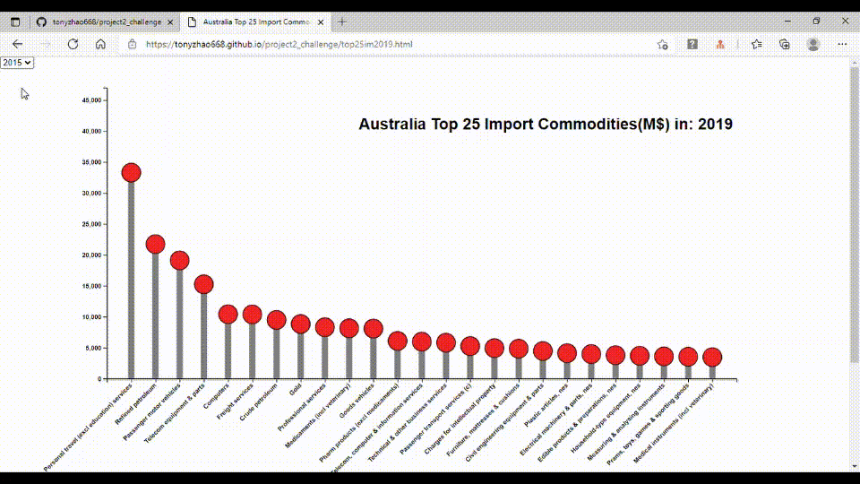

# project2_challenge

## Proposal for the Project 2

## Tony Zhao /DBC-UWA  17/04/2021

### Data Story: 
* Time Series Data visualization for Australian International trade,
	       What, where from, where to, values in the past years. 

### Final HTML and screenshots:

**Home Page:**

**Australia Export to countries by input any year pertime between 1987 - 2019**

**Austalia Import from countries by each click the replay show each year from 1987 to 2019**

**Top 25 Export Goods/Services:**

**Top 25 Import Goods/Services:**

           
### Data Source: 

* https://www.dfat.gov.au/trade/resources/trade-statistics/Pages/trade-time-series-data. Etc.

### Data Visualization/project categories: 

* D3.js and leaflet.js related visualization. 

### Procedures:
•	Data checking, cleaning;
•	PostgreSQL store the data, in several tables, if necessary;
•	Python Flask, js. powered Html/CSS, interactive web site to be presented
    at https://tonyzhao668.github.io/project2_challenge/;

### Schedule: 
	* 17/04/21 : subject select, proposal submit;
	* 20/04/21 : Data and SQL ready;
	* 22/04/21 : website and visualization ready hopefully;
	* 24/04/21 : test running and tunning/adjust, get advice from Daniel;
	* 27/04/21 : prepare for the slides for presentation;
	* 29/04/21 : final adjustment;
	* 01/05/21 : presentation. 
